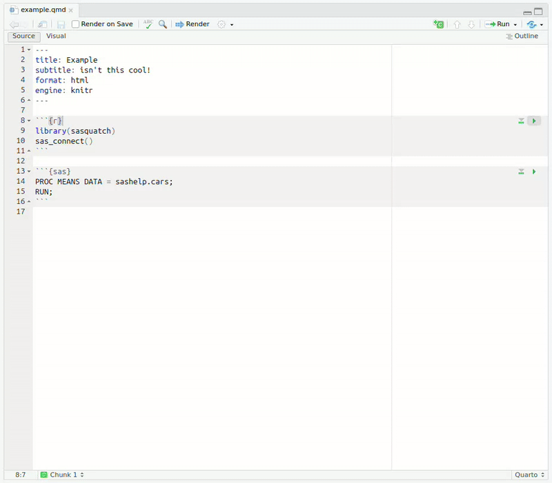
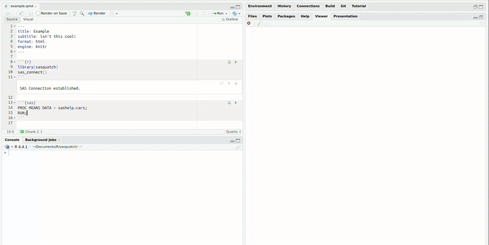

<!-- README.md is generated from README.Rmd. Please edit that file -->

# sasquatch

<!-- badges: start -->

[](https://github.com/ryanzomorrodi/sasquatch/actions/workflows/R-CMD-check.yaml)
[](https://app.codecov.io/gh/ryanzomorrodi/sasquatch?branch=main)
[](https://github.com/ropensci/software-review/issues/673)
<!-- badges: end -->

Use SAS, R, and Quarto Together

`sasquatch` allows you to combine the power of R, SAS, and quarto
together to create reproducible multilingual reports. `sasquatch` can:

- Run SAS code blocks interactively
- Send data back and forth between SAS and R
- Conduct basic file management on a SAS client
- Render html or latex SAS output within quarto/rmarkdown documents.

### Comparison with similar packages

`sasquatch` relies on the
[`SASPy`](https://sassoftware.github.io/saspy/) Python package and the
`reticulate` R package to interoperate with Python. There exist similar
packages, which work similarly to achieve related goals.

[`sasr`](https://CRAN.R-project.org/package=sasr)

- `sasr` works identically to `sasquatch` relying on the `SASPy` Python
  package to interface with SAS, but does not include any interactive,
  file management, or quarto functionality.

[`configSAS`](https://github.com/baselr/configSAS)

- Like `sasr` and `sasquatch`, `configSAS` relies on the `SASPy` Python
  package, but it primarily focuses on solely on `knitr` engine support.
- The `configSAS` engine HTML output CSS styles interfere with the rest
  of the document and SAS code output is not contained within a code
  block.
- `configSAS` is not actively maintained.

[`SASmarkdown`](https://CRAN.R-project.org/package=SASmarkdown)

- `SASmarkdown` does not rely on the `SASPy` Python package and thus is
  fairly simple to set up; however, it does require a SAS executable to
  be installed on the same machine as R.
- In contrast, `SASPy`-reliant packages can interface with both local
  and remote SAS installations and can easily pass data between R and
  SAS without the need for intermediate files.

`sasquatch` may be beneficial to you if you…

- Rely on a remote SAS client  
- Desire interactive SAS functionality while developing  
- Require remote SAS file management  
- Would like to be able to easily send data back and forth between SAS
  and R  
  without the use of intermediate files

## Installation

### Package installation

You can install the development version of sasquatch like so:

``` r
# install.packages("pak")
pak::pkg_install("ryanzomorrodi/sasquatch")
```

### Python installation

Make sure Python is installed on your system. If Python has not been
installed, you can install Python like so:

``` r
reticulate::install_python()
```

or download the installer from the [Python Software
Foundation](https://www.python.org/downloads/').

### `SASPy` installation

To install the `SASPy` package and its dependencies within a Python
virtual environment:

``` r
sasquatch::install_saspy()
```

### Configuration

Configuration for SAS can vary greatly based on your computer’s
operating system and the SAS platform you wish to connect to. For more
information check out `vignette("configuration")`.

**Don’t have a SAS license currently or just want to get set up
quickly?** Configure `sasquatch` for SAS On Demand for Academics using
the steps below:

#### Registration

SAS On Demand for Academics (ODA) is free SAS client for professors,
students, and independent learners. Create an account at
<https://welcome.oda.sas.com/>.

Once you have set up your account, log in and note the ODA server (in
the picture below United States 2) and your username (under the email in
the profile dropdown). We will need these for later.


#### Java installation

ODA relies on the IOM access method, which requires Java. Make sure Java
is installed on your system. You can download Java from [their
website](https://www.java.com/en/download/). Note the Java installation
path.

#### ODA Configuration

Set up for ODA is super easy. Run `config_saspy()` and follow the
prompts (you may need to recall your username, server, and java
installation path from earlier).

``` r
sasquatch::configure_saspy(template = "oda")
```

`config_saspy(template = "oda")` will create a `sascfg_personal.py` file
with all the relevant configuration information and create an `authinfo`
file, which will store your ODA credentials. More information about ODA
configuration can be found in the [ODA section of `SASPy` configuration
documentation](https://sassoftware.github.io/saspy/configuration.html#iom).

## Usage

Once you have setup `SASPy` and connected to the right python
environment using `reticulate` (if necessary), you can create a quarto
document like any other, call `sas_connect()`, and just get going!

```` default
---
format: html
engine: knitr
---

```{r}
library(sasquatch)
sas_connect()
```

```{sas}

```
````

### Code blocks

Now, you should be able to run SAS code blocks in RStudio like any
other.



### Sending output to viewer

If you want to send the SAS output to the viewer, you can utilize the
`sas_run_selected()` addin with a custom shortcut.



### Converting tables

Pass tables between R and SAS with `sas_from_r()` and `sas_to_r()`.

``` r
sas_from_r(warpbreaks, "warpbreaks")
sas_cars <- sas_to_r("cars", libref = "sashelp")
```

### Rendering quarto/rmarkdown documents

And of course, render beautiful HTML or latex quarto/rmarkdown documents
in the same style you would expect from SAS with the `sas_engine()`.


